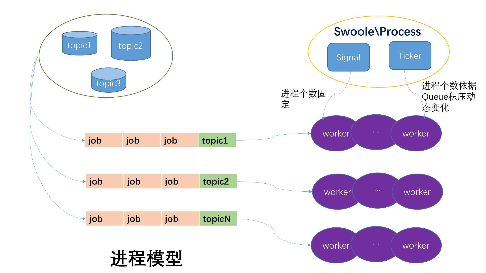

# swoole-jobs

* 基于swoole类似gearman的分布式任务处理系统
* 高性能/动态多woker进程消费队列，加速后端耗时服

## 1. 说明

* web中较慢的逻辑，比如统计/email/短信/图片处理等；
* 支持redis/rabbitmq/zeromq等任何一种做队列消息存储；
* 比yii／laravel等框架自带队列更稳定更快[消费进程可动态变化]
* 自带yii2/phalcon/yaf集成示例，其他框架可参考src/Action代码，[yii2完整示例](https://github.com/kcloze/swoole-jobs-yii2)

## 2. 架构图





## 3. 特性

* 基于swoole的job调度组件；类似gearman的分布式任务处理系统；
* redis/rabbitmq/zeromq等任何一种做队列消息存储(目前只实现redis/rabbitmq)；
* 利用swoole的process实现多进程管理，进程个数可配置，worker进程退出后会自动拉起；
* 子进程循环次数可配置，防止业务代码内存泄漏；默认stop命令会等待子进程平滑退出；
* 支持topic特性，不同的job绑定不同的topic；
* 每个topic启动对应数量的子进程，杜绝不同topic之间相互影响;
* 根据队列积压情况，子进程动态启动进程数，最大子进程个数可配置；
* 支持composer，可以跟任意框架集成；
* 日志文件自动切割，默认最大100M，最多5个日志文件，防止日志刷满磁盘；
* 挤压队列情况，支持发钉钉等消息提醒；


## 4. 安装

#### 4.1 composer
```
git clone https://github.com/kcloze/swoole-jobs.git
cd swoole-jobs

```
####  4.1.2 默认redis做队列；如果用rabbitmq做队列，需要增加包依赖：修改composer.json


```
    "require": {
        "php": ">=7.0",
        "ext-swoole": ">=1.8.9",
        "enqueue/amqp-ext": "0.8.9"
    },
```

```
composer install
```
#### 4.2 docker
* git clone https://github.com/kcloze/swoole-jobs.git
* cd swoole-jobs and composer install
* 根据根目录Dockerfile构建镜像
* docker build -t swoole-jobs .
* docker run  -it  -v ~/data/code/php:/data swoole-jobs /bin/bash
* 进入容器之后，进入项目目录：php swoole-jobs.php start

## 5. 运行

### 5.1 示范
```
1.修改配置config.php

2.启动服务
php ./swoole-jobs.php start >> log/system.log 2>&1

3.往队列推送任务
php ./test/testJobs.php

```

### 5.2 启动参数说明
```
NAME
      php swoole-jobs - manage swoole-jobs

SYNOPSIS
      php swoole-jobs command [options]
          Manage swoole-jobs daemons.


WORKFLOWS


      help [command]
      Show this help, or workflow help for command.

      status [command]
      Show master and workers status.

      restart
      Stop, then start swoole-jobs master and workers.

      start
      Start swoole-jobs master and workers.

      stop
      Wait all running workers smooth exit, please check swoole-jobs status for a while.

      exit
      Kill all running workers and master PIDs.


```


## 6. 服务管理
### 线上启动和关闭服务,有两种方式:

#### 6.1 启动脚本加入到crontab定时任务，每分钟执行一次(swoole-jobs会自动检查是否在执行，避免重复启动)

```
* * * * * /usr/local/bin/php /***/swoole-jobs.php start >> /***/log/system.log 2>&1

```


#### 6.2 使用systemd管理(故障重启、开机自启动)
[更多systemd介绍](https://www.swoole.com/wiki/page/699.html)

```
1. 根据自己项目路径,修改 systemd/swoole-jobs.service
2. sudo cp -f systemd/swoole-jobs.service /etc/systemd/system/
3. sudo systemctl --system daemon-reload
4. 服务管理
#启动服务
sudo systemctl start swoole-jobs.service
#reload服务
sudo systemctl reload swoole-jobs.service
#关闭服务
sudo systemctl stop swoole-jobs.service
```


## 7. change log
#### 2017-12-31
* 挤压队列情况，支持发钉钉等消息提醒；
* 支持status状态显示命令；
* 静态子进程可能重启失败，增强日志记录；

#### 2017-12-10
* worker子进程支持个数可以根据队列挤压情况动态变化；
* worker子进程最大和最小启动个数可配置；

#### 2017-12-4
* 子进程启动模式变更：单独给每个topic启动对应数量的子进程，杜绝不同topic之间相互影响

#### 2017-11-30
* 增加exit启动参数，默认stop等待子进程平滑退出


#### 2017-11-29
* 重构自身和第三方框架装载类实现，降低耦合性；
* 支持Yii和Phalcon主流框架


#### 2017-11-28 16:52:42 
* topics支持根据key值排序，队列根据这个排序优先消费；
* 优化启动流程，让PHP进程自身管理，移除服务管理脚本；
* 重构代码，优化结构；


#### 2017-11-28 00:27:42 

> by [daydaygo](http://github.com/daydaygo)

- 优化 TopicQueue 实现: `TopicQueueInterface -> BaseTopicQueue -> XxxTopicQueue`
- 优化 job run() 方式, 增加类静态方法实现, 并实现多参数输入
- 使用依赖注入方式进行解耦, 比如 `Jobs` 类依赖 `BaseTopicQueue` 抽象类, 不和具体的 `TopicQueue` 实现耦合; 比如配置的解耦, `Jobs` 类只用关系自己业务相关的配置, 不用耦合其他配置
- 添加 php 进行服务管理

#### 2017-5-19

* 增加使用systemd管理swoole服务,实现故障重启、开机自启动等功能

## 8. 注意事项

* 如果嵌入自己的框架，可参考src/Action代码，继承抽象类Kcloze\Jobs\Action\BaseAction


## 9. 压测

* 瓶颈: redis/rabbitmq队列存储本身和job执行速度


## 10. 感谢

* [swoole](http://www.swoole.com/)

## 11. 联系

qq群：141059677


